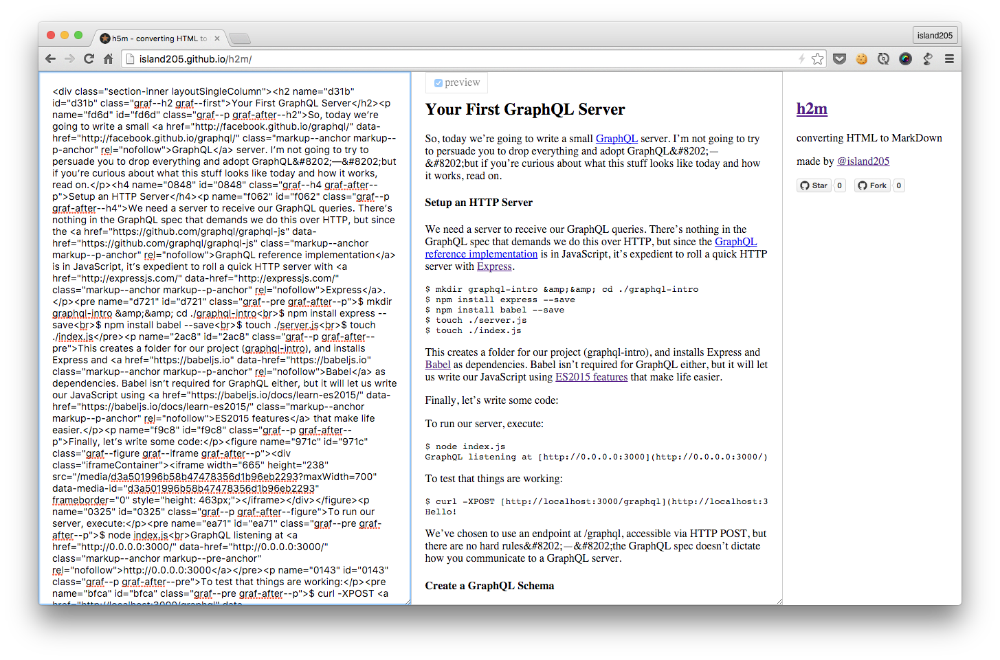

# h2m


[](https://www.npmjs.com/package/h2m)
[](https://travis-ci.org/island205/h2m)
[](https://coveralls.io/github/island205/h2m)

Tool for converting HTML to Markdown, like [html2markdown](https://github.com/29decibel/html2markdown).

online converter: http://island205.github.io/h2m/



## Install

```bash
$npm install h2m
```
## How to use

**h2m(html[, options])**

### example

```javascript
var h2m = require('h2m')

var md = h2m('<h1>Hello World</h1>')
// md = '# Hello World'
```

### options

- `converter`: the converter you can choose. now support `CommonMark`(default) and `MarkdownExtra`
- `overides`: custom converter behavior:

```javascript
h2m('<a href="http://island205.github.io/h2m/">h2m</a>', {
    overides: {
        a: function(node) {
          /**
          node is an object as the a tag:
          {
            name: "a",
            attrs: {
              href: 'http://island205.github.io/h2m/'
            },
            md: 'h2m'
          }
          */
          return `[This is an link element](${node.attrs.href})`
        }
    }
}

// output [This is an link element](http://island205.github.io/h2m/)
```


## Command Line Tool

### install

```bash
$ npm install h2m -g
```

[](https://www.npmjs.com/package/h2m)

### usage

```
$h2m -h

Usage: h2m [options] <file>

Options:

  -h, --help     output usage information
  -V, --version  output the version number
```

Convert a local file:

```bash
$ h2m index.html

converting HTML to Markdown

made by [@island205](https://github.com/island205)

Can't be convert? welcome to submit an [issue](https://github.com/island205/h2m/issues/new).
```

Convert an online url:

```bash
$ h2m https://baidu.com
```

Save result:

```bash
$ h2m https://google.com > google.md
```

## Support

`h2m` supports standard Markdown sytax: [CommonMark](http://commonmark.org/help/) now and [Markdown Extra](https://michelf.ca/projects/php-markdown/extra/).

### CommonMark

- :white_check_mark: br
- :white_check_mark: em
- :white_check_mark: strong
- :white_check_mark: code
- :white_check_mark: a
- :white_check_mark: img
- :white_check_mark: hr
- :white_check_mark: ul, ol
- :white_check_mark: pre
- :white_check_mark: div
- :white_check_mark: p
- :white_check_mark: blockquote
- :white_check_mark: h1 ~ h6

### Markdown Extra

- :white_check_mark: Special Attributes for headers link and image
- :white_check_mark: Fenced Code Blocks
- :white_check_mark: dl, dt, dd Definition Lists
- :white_check_mark: abbr Abbreviations
- :white_check_mark: table (tks [@天凉](https://github.com/daycool)'s PR')

## Contribution

PRs are welcome to implement other extend Markdown language, like [Markdown Extra](https://en.wikipedia.org/wiki/Markdown_Extra), [GFM](https://help.github.com/articles/github-flavored-markdown/) and so on.
